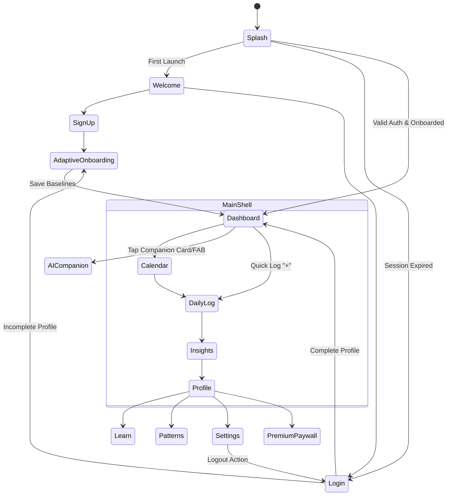

# FlowCycle — Product Requirements Document (PRD)

**Document Version:** 1.0.0  
**Status:** Approved Baseline  
**Product:** FlowCycle (iOS & Android)  
**Target Delivery:** v1.0 Production  

---

## 1. Product Vision

### 1.1 What is FlowCycle?
**FlowCycle** is a high-end, privacy-first menstrual health, fertility tracking, and holistic women’s wellness application built with Flutter. Inspired by the clarity, elegance, and tactile polish of Apple Health, Flo, and luxury wellness products, FlowCycle provides accurate cycle forecasts, evidence-based reproductive health insights, and an intelligent wellness companion.

### 1.2 Target Audience
* **Adolescents & Young Adults:** Individuals seeking an intuitive, welcoming, non-intimidating way to learn about their bodies and predict menstrual dates.
* **Health & Wellness-Conscious Women:** Women seeking to optimize hormonal balance, energy, exercise, and mental well-being across the four biological phases.
* **Conception Planners (TTC):** Individuals and couples actively planning pregnancy who need accurate fertile window forecasts, ovulation biomarker logging, and basal body temperature analysis.
* **Women with Cycle Irregularities:** Individuals experiencing PCOS, endometriosis, or irregular cycles who need detailed pattern tracking and shareable clinical reports.

### 1.3 Core Problems Solved
1. **Visual Clutter & Clinical Anxiety:** Many period tracking apps are overloaded with aggressive advertisements, jarring neon aesthetics, or confusing medical jargon. FlowCycle provides a calm, editorial-grade sanctuary.
2. **One-Size-Fits-All Inflexibility:** A woman managing PMS has vastly different priorities than someone testing luteinizing hormone (LH) to conceive. FlowCycle solves this with two dedicated app modes.
3. **Data Overload without Meaning:** Logging 20 symptoms a day is useless without actionable correlation. FlowCycle translates symptom inputs into intuitive phase insights and trend discoveries.
4. **Data Privacy Concerns:** Reproductive health data demands the highest degree of security, encryption, and user agency.

### 1.4 Unique Value Proposition (UVP)
> *“A calm, intelligent, and beautifully refined reproductive wellness companion that seamlessly adapts between cycle awareness and conception planning.”*

---

## 2. User Personas

| Attribute | Persona 1: Maya (17) | Persona 2: Elena (28) | Persona 3: Sarah (33) | Persona 4: Priya (30) |
| :--- | :--- | :--- | :--- | :--- |
| **Profile** | High School Student | Product Designer & Runner | Marketing Director | Software Engineer |
| **Primary Goal** | Predict periods & avoid surprises | Sync workouts/diet with cycle phases | Conceive naturally within 6 months | Understand irregular cycles & PCOS |
| **Primary Mode** | Cycle Awareness | Cycle Awareness | Trying to Conceive (TTC) | Cycle Awareness / TTC |
| **Pain Points** | Embarrassing ads, complex medical terms | Energy crashes, unpredictable PMS | Anxiety around ovulation timing | Cycles vary from 25 to 45 days |
| **Key Needs** | Discreet notifications, simple calendar | Phase-based nutrition/workout tips | BBT tracking, LH surge alerts | Longitudinal trend export for OB-GYN |

---

## 3. Application Modes

FlowCycle features two primary operational modes selectable during onboarding or dynamically toggled via the dashboard header and user profile.

```
                    ┌─────────────────────────────────────────┐
                    │            FLOWCYCLE MODES              │
                    └────────────────────┬────────────────────┘
                                         │
                 ┌───────────────────────┴───────────────────────┐
                 ▼                                               ▼
   ┌───────────────────────────┐                   ┌───────────────────────────┐
   │   CYCLE AWARENESS MODE    │                   │ TRYING TO CONCEIVE (TTC)  │
   ├───────────────────────────┤                   ├───────────────────────────┤
   │ • Period prediction ring  │                   │ • Fertile window & score  │
   │ • 4-Phase biological info │                   │ • Ovulation test & LH log │
   │ • PMS & energy forecast   │                   │ • BBT biphasic curve chart│
   │ • Daily symptom logging   │                   │ • Intimacy & timing log   │
   └───────────────────────────┘                   └───────────────────────────┘
```

### 3.1 Mode 1: Cycle Awareness
* **Primary Goal:** Provide menstrual cycle predictability, hormonal awareness, and daily wellness balance.
* **Dashboard Focus:** Prominent cycle wheel illustrating the current phase (Menstrual, Follicular, Fertile, Ovulation, Luteal), days until next period, and daily body insights.
* **Key Features:** Period duration tracking, PMS symptom logging, hormonal skin/energy patterns, phase-specific wellness tips.
* **Success Metric:** User feels in control of their daily health and is never surprised by their period.

### 3.2 Mode 2: Trying to Conceive (TTC)
* **Primary Goal:** Pinpoint ovulation, maximize conception probability, and monitor physiological fertility indicators.
* **Dashboard Focus:** Conception Chance Index (Low, High, Peak), ovulation countdown, BBT thermal shift graph, and fertile window indicator.
* **Key Features:** Basal Body Temperature (BBT) plotting with coverline detection, Ovulation Predictor Kit (OPK/LH) test logging, cervical mucus classification, intercourse timing log.
* **Success Metric:** Confirmed ovulation detection, clear identification of optimal conception days, and actionable fertility history.

---

## 4. Complete Screen Inventory

```
FlowCycle Screen Hierarchy
├── Authentication & Onboarding
│   ├── SCR-01: Splash Screen
│   ├── SCR-02: Welcome / Value Carousel Screen
│   ├── SCR-03: Sign In Screen
│   ├── SCR-04: Sign Up Screen
│   ├── SCR-05: Forgot / Reset Password Screen
│   ├── SCR-06: Onboarding Goal & Mode Selector
│   ├── SCR-07: Onboarding Last Period Date Picker
│   ├── SCR-08: Onboarding Cycle & Period Length Input
│   └── SCR-09: Onboarding Notification & Privacy Permissions
│
├── Main Application Shell (Bottom Navigation)
│   ├── SCR-10: Dashboard / Home (Adaptive: Cycle Awareness or TTC)
│   ├── SCR-11: Calendar & Timeline View
│   ├── SCR-12: Daily Log Entry & Symptom Sheet
│   ├── SCR-13: Insights & Cycle Analytics
│   └── SCR-14: Profile & Health Records
│
└── Secondary & Modal Flows
    ├── SCR-15: AI Health Companion Chat
    ├── SCR-16: Learn Article Feed & Educational Library
    ├── SCR-17: Educational Article Detail View
    ├── SCR-18: Cycle Patterns & Symptom Trends
    ├── SCR-19: Settings & Preferences
    ├── SCR-20: Data Privacy & Export PDF Health Report
    └── SCR-21: FlowCycle Premium Paywall
```

---

## 5. Navigation & User Flows



---

## 6. Core Functional Requirements

### 6.1 Cycle Tracking & Forecast Engine
* **Calculations:** Dynamically calculate future period start dates, fertile windows, and ovulation using standard historical weighted moving averages (default 28-day cycle, 5-day menstruation, 14-day luteal phase).
* **Adaptability:** Adjust predictions dynamically when irregular cycles or PCOS flags are toggled.

### 6.2 Daily Symptom & Biomarker Logging
* **Flow Intensity:** None, Spotting, Light, Medium, Heavy.
* **Moods:** Calm, Happy, Energetic, Irritable, Anxious, Low Energy, Sensitive.
* **Physical Symptoms:** Cramps, Tender Breasts, Headache, Bloating, Acne, Lower Back Pain, Nausea.
* **Cervical Fluid:** Dry, Sticky, Creamy, Watery, Egg White (Fertile).
* **Basal Body Temperature:** Decimal input (0.01° precision, °F or °C).
* **Intimacy & Tests:** Intercourse (protected/unprotected), Ovulation Test (Negative/Positive/Peak), Pregnancy Test.

### 6.3 Calendar & Timeline
* Monthly grid and continuous vertical scroll with color-coded phase indicators.
* Historical logs, future projections, and quick-tap day details.

### 6.4 Insights & Patterns
* **Cycle Statistics:** Average cycle length, average period length, cycle variability (± days).
* **Pattern Recognition:** Recurring symptom correlations across phases (e.g., "Headaches frequently occur 2 days before menstruation").

### 6.5 AI Health Companion
* Context-aware, supportive conversational interface answering questions on cycle phases, wellness, symptoms, and reproductive science.
* Enforced medical safety disclaimer on all responses.

### 6.6 Learn Library
* Evidence-based, medically reviewed educational articles categorized by: Menstrual Health, Conception, Nutrition, Movement, and Hormonal Balance.

### 6.7 Notifications & Reminders
* Upcoming period alert (1, 2, or 3 days prior).
* Fertile window & ovulation reminder (TTC mode).
* Daily logging reminder at customizable time.
* Late period notification.

---

## 7. High-Level Data Model

```text
┌─────────────────┐       1:N       ┌─────────────────┐
│      User       ├────────────────►│      Cycle      │
│─────────────────│                 │─────────────────│
│ id: UUID        │                 │ id: UUID        │
│ email: String   │                 │ userId: UUID    │
│ appMode: Enum   │                 │ startDate: Date │
│ isPremium: Bool │                 │ endDate: Date?  │
│ themeMode: Enum │                 │ lengthDays: Int │
└────────┬────────┘                 └────────┬────────┘
         │                                   │
         │ 1:N                               │ 1:N
         ▼                                   ▼
┌─────────────────┐                 ┌─────────────────┐
│   UserGoal /    │                 │    DailyLog     │
│   Preferences   │                 │─────────────────│
│─────────────────│                 │ id: UUID        │
│ baselineCycle:  │                 │ cycleId: UUID?  │
│ baselinePeriod: │                 │ date: Date      │
│ reminderTimes:  │                 │ flow: FlowEnum? │
└─────────────────┘                 │ bbt: Double?    │
                                    │ notes: String?  │
                                    └────────┬────────┘
                                             │
                       ┌─────────────────────┴─────────────────────┐
                       │ 1:N                                       │ 1:N
                       ▼                                           ▼
             ┌───────────────────┐                       ┌───────────────────┐
             │    SymptomLog     │                       │      MoodLog      │
             │───────────────────│                       │───────────────────│
             │ symptomId: String │                       │ moodId: String    │
             │ severity: Int     │                       │ intensity: Int    │
             └───────────────────┘                       └───────────────────┘
```

---

## 8. Design & Aesthetic Principles

1. **Editorial Elegance:** Clean typography, generous white space, and warm cream surfaces (`#FAF7F2`) avoid the cold clinical feel of traditional medical apps.
2. **Tactile & Soft:** Generous border radii (`16–24pt`), frosted glass cards, and soft ambient shadows create a calming experience.
3. **Harmonious Color Semantics:** Pastel gradients and dedicated phase hues (Crimson Rose, Coral, Turquoise, Lilac, Amber) provide instant visual recognition without visual clutter.
4. **Accessible & Intuitive:** High-contrast text labels, clear iconography, and touch targets meeting Apple HIG and Material Accessibility standards (minimum 48×48dp).

---

## 9. Monetization & Subscription Tiers

```
┌──────────────────────────────────────┬──────────────────────────────────────┐
│             FREE TIER                │          FLOWCYCLE PREMIUM           │
├──────────────────────────────────────┼──────────────────────────────────────┤
│ • Basic period & cycle tracking      │ • Unlimited AI Companion coaching    │
│ • 3-month forecast timeline          │ • Full BBT coverline & ovulation AI  │
│ • Daily standard symptom logging     │ • Longitudinal symptom pattern engine│
│ • Standard calendar view             │ • PDF Health & OB-GYN Clinical Export│
│ • Essential wellness articles        │ • Cycle regularity analysis (PCOS)   │
│                                      │ • Advanced fertility score breakdown │
└──────────────────────────────────────┴──────────────────────────────────────┘
```

---

## 10. Out of Scope for Version 1.0

* Direct Bluetooth hardware sync with smart rings (e.g., Oura) or smart thermometers (manual BBT input only for v1).
* Pregnancy Milestones / Kick Counter Mode (planned for v2.0).
* Multi-user Partner Sharing Mode.
* Community Forums / Social Feeds (to preserve utmost privacy in v1).

---

## 11. Future Roadmap

* **v1.1:** Apple Health & Google Health Connect bidirectional sync.
* **v1.2:** Clinical PDF Report Generator with physician-tailored charts.
* **v2.0:** Pregnancy Mode (trimester tracking, fetal development visuals, kick counter).
* **v2.1:** Partner Mode (private synchronization of cycle phase and fertility status).
* **v2.2:** AI Voice & Multimodal symptom logging.
